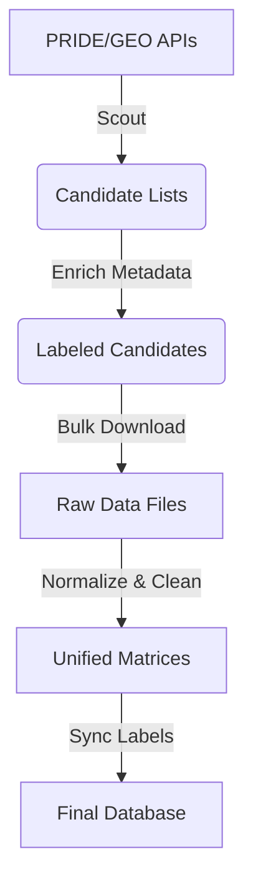

# EVDx Pipeline Architecture

This document details the automated pipeline used to create the EVDx database. All scripts are located in the `scripts/` directory.

## 1. Pipeline Overview

The pipeline follows a linear flow: **Scout $\rightarrow$ Enrich $\rightarrow$ Download $\rightarrow$ Normalize $\rightarrow$ Sync**.



---

## 2. Detailed Steps

### A. Scouting (Identification)
**Goal:** Find "Gold Standard" datasets without manual searching.

*   **Proteins (`01_pride_scout.py`):**
    *   Queries PRIDE API for `Homo sapiens` AND (`plasma` OR `serum`).
    *   **Critical Filter:** Checks file list for `proteinGroups.txt` (MaxQuant output) or Excel results. Discards raw-only studies.
*   **miRNA (`05_geo_scout.py`):**
    *   Queries GEO for `non-coding RNA profiling` AND `plasma/serum`.
    *   Filters for studies with >10 samples and available count matrix files.

### B. Metadata Enrichment (Labeling)
**Goal:** Turn vague IDs (`GSE12345`) into clinical context (`Alzheimer's`).

*   **Deep Metadata (`06_enrich_geo...`, `07_enrich_pride...`):**
    *   Fetches detailed sample attributes (age, diagnosis, tissue) from the APIs.
*   **Literature Mining (`11_fetch_pubmed_abstracts.py`):**
    *   Takes the Study Title/ID.
    *   Queries **PubMed API** to get the full abstract.
    *   Uses Keyword Matching (regex) to assign labels like "Ovarian Cancer", "COVID-19", "Sepsis".

### C. Data Acquisition
**Goal:** Fetch the actual data files.

*   **Proteins (`02_download_pride_data.py`):**
    *   Downloads specific target files (tables) from PRIDE FTP/HTTP.
*   **miRNA (`08_download_geo_data.py`):**
    *   Scrapes GEO FTP directories for `suppl` files.
    *   Downloads `.txt.gz`, `.csv.gz`, `.xlsx` matrices.

### D. Normalization & Harmonization
**Goal:** Make the data comparable.

*   **Proteins (`09_normalize_proteins.py`):**
    *   Parses `proteinGroups.txt`.
    *   Extracts `LFQ intensity` columns.
    *   Maps `Gene names` column as the Index.
    *   Log2 transforms data.
*   **miRNA (`10_normalize_mirna.py`):**
    *   **ID Cleaning:** Converts variations (`hsa-let-7a-5p`, `Let-7a`, `mir-let-7a`) to a standard `hsa-mir-` format.
    *   **Pipe Handling:** Extracts canonical names from complex pipeline IDs (e.g., `seq|let-7a|...` $\rightarrow$ `hsa-mir-let-7a`).
    *   **Filtering:** Removes GO Terms and non-sequence rows.
    *   **Aggregation:** Sums counts for duplicate IDs.

### E. Synchronization
*   **Sync (`12_sync_labels.py`):**
    *   Injects the high-quality labels from Step B into the final metadata files generated in Step D.

---

## 3. Key Decisions & Trade-offs

| Decision | Rationale |
| :--- | :--- |
| **MaxQuant Only** | Ensures identical column structures (`LFQ intensity`) and reduces normalization complexity. |
| **Discard Raw Data** | Reprocessing raw mass spec/FASTQ files would require Terabytes of storage and months of compute. |
| **Keep Sparse Features** | We retained miRNAs detected in only one study ("junk" rows) because they might be valid biomarkers specific to a capture kit. |
| **Log2 Transform** | Standard variance-stabilizing transformation for biological data. |

```